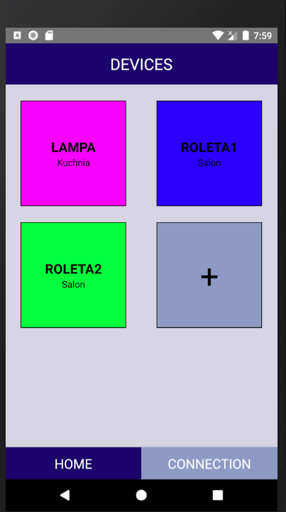
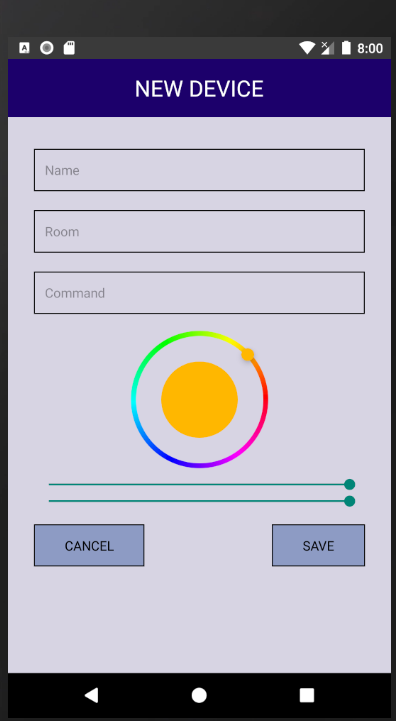

# IoT React Native
> An app - skeleton for a development of internet of things.

## Technologies
* React Native
* JavaScript
* HTML
* CSS

## Usage
App allows you to add various devices to the list. 

## Screenshots

## Installation

Clone the project and run `npm install`

`npm react-native run-android`

